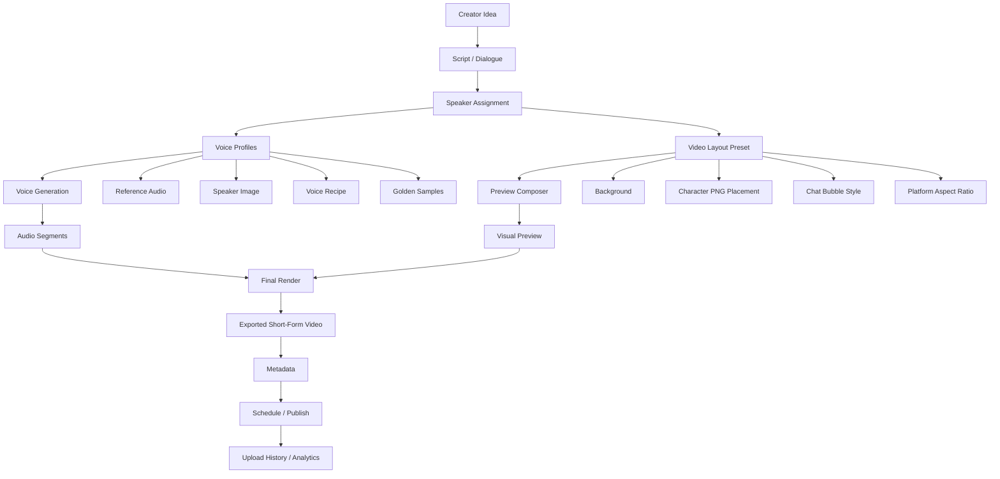
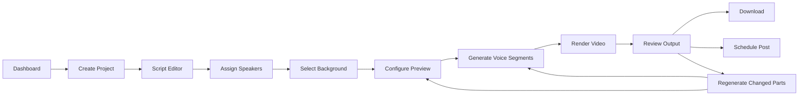
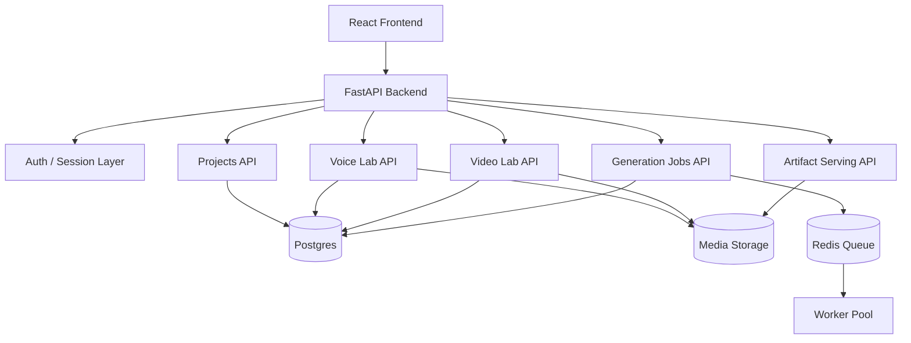
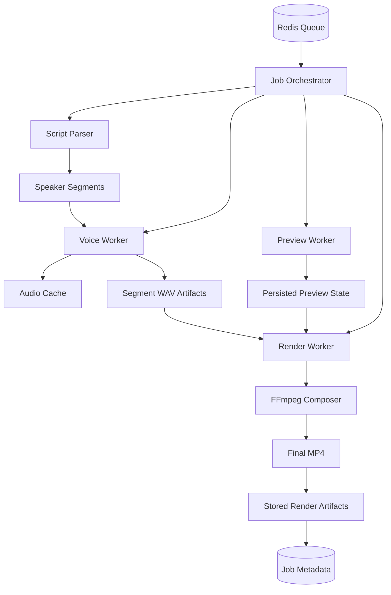
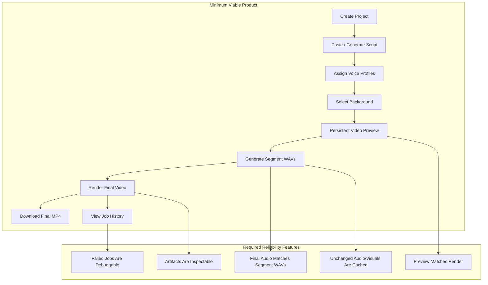
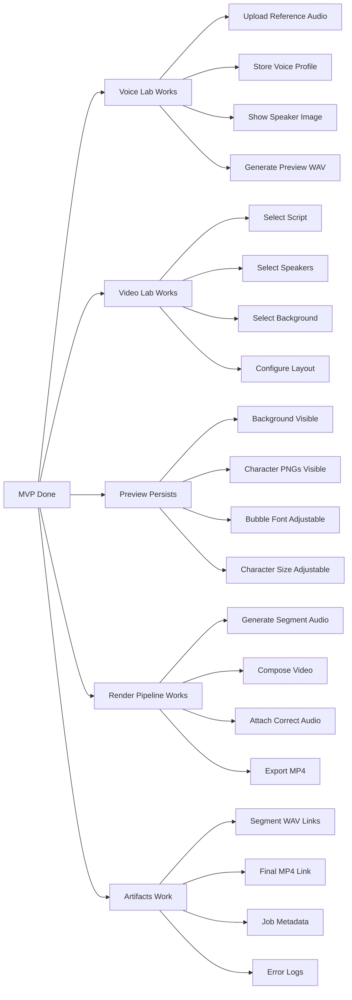
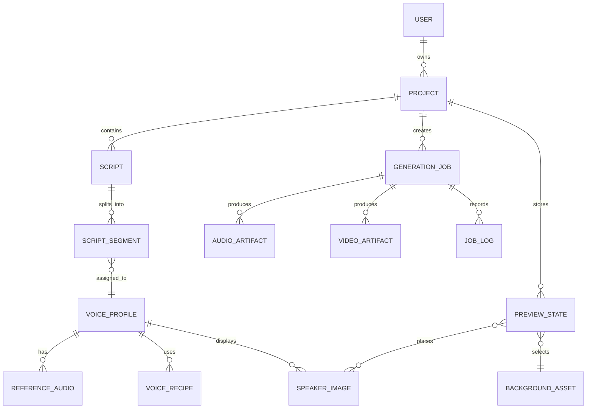
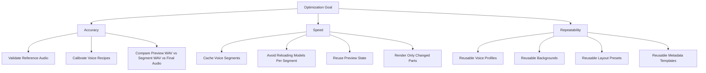

# OmniPoster System Design Graph

**Vision:** OmniPoster is a reusable AI content pipeline that turns scripts, character voices, backgrounds, and layout presets into polished short-form videos ready for posting.

---

## 1. Final Vision System Map

---

## 2. Product Flow

---

## 3. Backend Architecture

---

## 4. Worker Architecture

---

## 5. Full MVP Boundary

---

## 6. MVP Feature Checklist

---

## 7. Core Data Model

---

## 8. Optimization Strategy

